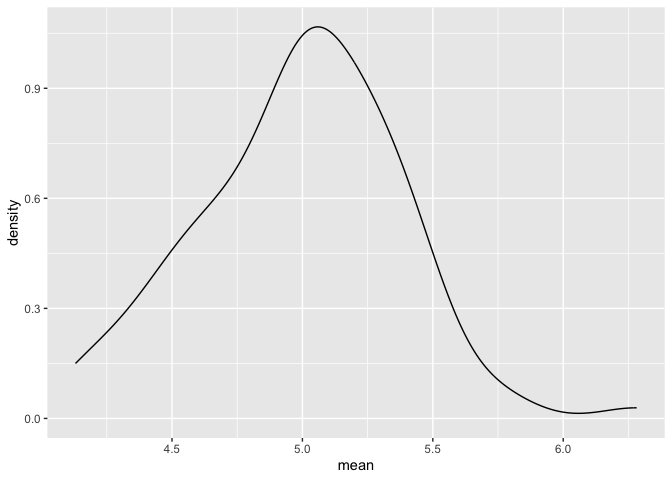
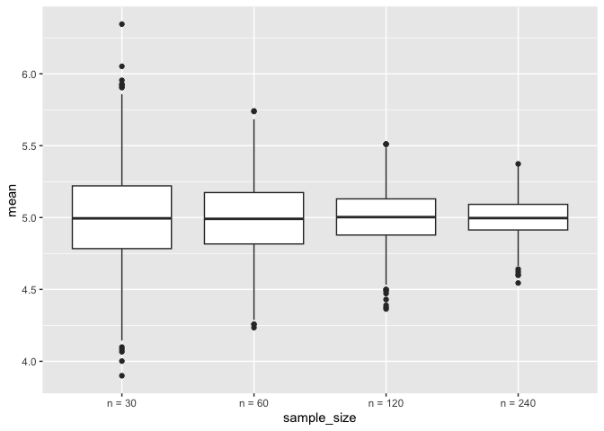
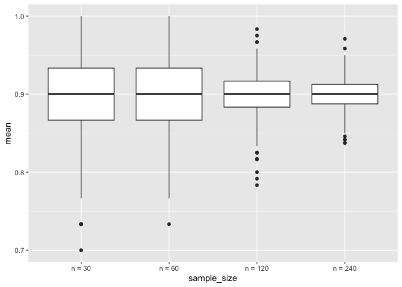

simulation
================
Shihui Peng
2023-11-15

load package and set seed for reproducibility

# simulate sample mean and sd

here is an old function:

``` r
sim_mean_sd = function(n_obs, mu = 5, sigma = 2) {
  
  x_vec = rnorm(n = n_obs, mean = mu, sd = sigma)

  tibble(
   mean = mean(x_vec),
   sd = sd(x_vec)
  )
}
```

let’s see what it does.

``` r
sim_mean_sd(n_obs=30)
```

    ## # A tibble: 1 × 2
    ##    mean    sd
    ##   <dbl> <dbl>
    ## 1  5.16  1.85

i dont get same things everytime when i rerun this.

let’s iterate to see how this works under repeated sampling…

``` r
output = vector('list', length = 100)

for (i in 1:100){
  output[[i]] = sim_mean_sd(n_obs = 30)
}

sim_results = bind_rows(output)

sim_results |> 
  ggplot(aes(x = mean)) + geom_density()
```

<!-- -->

``` r
sim_results |> 
  summarize(
    mu_hat = mean(mean),
    sd_hat = sd(mean)
  )
```

    ## # A tibble: 1 × 2
    ##   mu_hat sd_hat
    ##    <dbl>  <dbl>
    ## 1   4.99  0.385

use a map function

``` r
sim_result_df = 
  expand_grid(
    sample_size = c(30, 60, 120, 240),
    iter = 1:1000
  ) |> 
  mutate(estimate_df = map(sample_size, sim_mean_sd)) |> 
  unnest(estimate_df)

sim_result_df |> 
  mutate(
    sample_size = str_c('n = ', sample_size),
    sample_size = fct_inorder(sample_size)
  ) |> 
  ggplot(aes(x = sample_size, y = mean)) + geom_boxplot()
```

<!-- -->

``` r
# In summary:
# fct_inorder() is used to reorder levels based on the order in which they appear.
# relevel() is used to set a specific level as the reference level.
# reorder() is used to reorder levels based on the values of a continuous variable.
```

# try binomial dist

``` r
sim_mean_sd_bi = function(n_obs, true_p = 0.9) {
  
  x_vec = rbinom(n = n_obs, size = 1, prob = true_p)

  tibble(
   mean = mean(x_vec),
   sd = sd(x_vec)
  )
}

# then the map part
sim_result_df = 
  expand_grid(
    sample_size = c(30, 60, 120, 240),
    iter = 1:1000
  ) |> 
  mutate(estimate_df = map(sample_size, sim_mean_sd_bi)) |> 
  unnest(estimate_df)

sim_result_df |> 
  mutate(
    sample_size = str_c('n = ', sample_size),
    sample_size = fct_inorder(sample_size)
  ) |> 
  ggplot(aes(x = sample_size, y = mean)) + geom_boxplot()
```

<!-- -->
